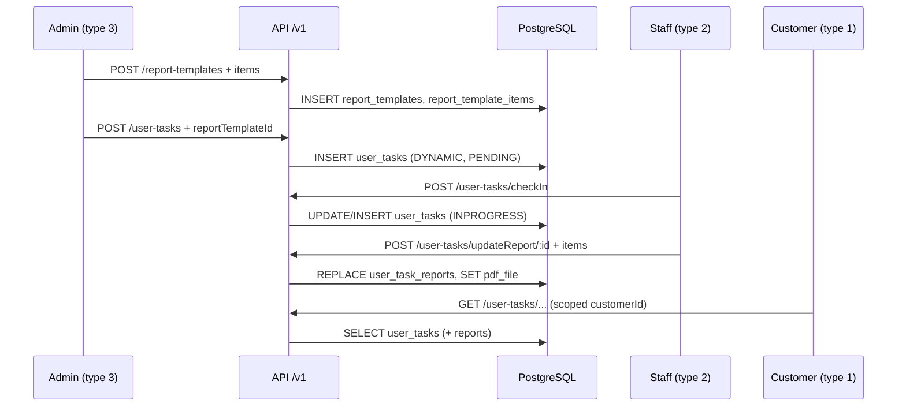

# Report templates and submitted reports — schema and flows

This document describes how **report templates** are defined, how they attach to **jobs / user tasks**, and how **staff** vs **clients (customers)** interact with submitted reports. It is derived from the NestJS API and admin app under `c:\app_from_host`.

---

## 1. User types (JWT `user.type`)

Defined in `service_link_api-main/src/constants/user.ts`:

| Numeric value | Constant     | Typical role |
|---------------|--------------|--------------|
| **3**         | `userType.ADMIN`    | Platform / company administrator (creates templates, schedules work, sees broad data) |
| **2**         | `userType.STAFF`    | Field staff (check-in, fill reports, complete tasks) |
| **1**         | `userType.CUSTOMER` | Client / customer (sees tasks and reports for their account) |

Throughout this doc, **“admin (type 3)”** refers to users with `type === 3`.

---

## 2. Core data model (PostgreSQL / TypeORM)

### 2.1 `report_templates`

Entity: `service_link_api-main/src/report-templates/entities/report-template.entity.ts`  
Table: **`report_templates`**

| Field (logical) | Notes |
|-----------------|--------|
| `id` | Primary key |
| `name`, `description` | Template title and description |
| `category` | Postgres enum `report_templates_category_enum`; allowed values in `report-template-categories.ts` (e.g. `GENERAL`, `MAINTENANCE`, `CLEANING`, …) |
| `order` | Sort / display order |
| `file_url` | Optional sample document URL (PDF/DOC, etc.) |
| `status` | Active flag (`eStatus` pattern) |
| `settings` | Optional JSONB |
| **Relation** | One-to-many → `report_template_items` |

### 2.2 `report_template_items`

Entity: `report-templates/entities/report-template-item.entity.ts`  
Table: **`report_template_items`**

Defines the **form schema** staff (or the UI) follows: field `name`, `type`, `order`, optional `value`, `required`, `config` (JSONB for label, options, validation, defaults).

**Field types** (API enum `ReportTemplateItemType` in `create-report-template.dto.ts`) include:

`TEXT`, `TEXTAREA`, `RICH_TEXT`, `NUMBER`, `PERCENTAGE`, `CURRENCY`, `YES_NO`, `SELECT`, `CHECKLIST`, `TABLE`, `SIGNATURE`, `GPS`, `DATE`, `TIME`, `IMAGES`, `VIDEOS`, plus auto placeholders: `[REPORT_DATE]`, `[REPORT_TIME]`, `[SITE_NAME]`, `[SITE_ADDRESS]`, `[CUSTOMER_NAME]`, `[REPORT_BY]`.

### 2.3 `user_tasks`

Entity: `user-tasks/entities/user-task.entity.ts`  
Table: **`user_tasks`**

A **scheduled or ad-hoc job instance** assigned to a staff member, tied to site/customer/department and a **single report template**:

| Field | Role |
|-------|------|
| `staff_id` | Assigned staff |
| `customer_id`, `customer_name`, `company_name` | Client context |
| `site_id`, `site_name`, `site_address`, `site_location` | Where the work happens |
| `report_template_id` | **FK → `report_templates.id`** — which form definition to use |
| `task_id`, `task_shift_id`, `task_name` | Links to recurring / shift tasks when `type` is schedule-driven |
| `status` | See §4 (`dJobStatus`) |
| `type` | e.g. `"DYNAMIC"` (created from admin scheduling), `"FIXED"` (check-in path), `"CUSTOM"` (customer-submitted style flow) |
| `check_in`, `check_out` | Times |
| `pdf_file` | Generated PDF URL after report submission / conversion |
| **Relation** | One-to-many → `user_task_reports` |

### 2.4 `user_task_reports`

Entity: `user-tasks/entities/user-task-report.entity.ts`  
Table: **`user_task_reports`**

**Submitted answers** for one `user_tasks` row (instances of template fields):

| Field | Role |
|-------|------|
| `user_task_id` | Parent task |
| `name`, `type`, `order` | Align with template item identity / ordering |
| `value` | Stored answer (string; `TIME` may be normalized on create) |

**Conceptual ERD:**

```text
report_templates (1) ──< report_template_items
        │
        │ report_template_id
        ▼
   user_tasks (1) ──< user_task_reports
        │
        ├── staff_id → users
        └── customer_id → users
```

---

## 3. How admins (user type 3) create report templates

### 3.1 Who is “admin” in code

- JWT payload includes **`userId`** and **`type`**. **`userType.ADMIN === 3`** (`service_link_api-main/src/constants/user.ts`).
- Report-template REST endpoints only require **`JwtAuthGuard`** — they do **not** check `type === 3`. Operationally, the **Report Templates** menu and scheduling screens are intended for administrator accounts.

### 3.2 Admin UI — navigation and screens

| Step | Location | What happens |
|------|----------|----------------|
| Open list | Route **`report-templates`** (`service_link_admin-main/src/containers/routes.tsx`) | `containers/report-templates/index.tsx` loads the grid via Redux. |
| List data | Saga | `redux/report-templates/saga.ts` → `GET /v1/report-templates` with list query params (`getData`). |
| Categories dropdown | Container | `GET /v1/report-templates/categories`; response normalized to `{ id, name }[]` for the editor (`normalizeCategoryOptionsResponse`). |
| Create / edit / view | Modal / drawer | `components/report-templates/index.tsx` — **3 steps**: (1) Details — name, description, category, optional sample file upload; (2) **Fields** — add/reorder/drag template items; (3) **Preview**. |
| Save | `onFinishSave` | Validates `name`, `category`, `description`; builds payload (see §3.4); dispatches `saveInto` with `actionType.ADD` or `UPDATE`. |
| Duplicate / delete | Same list | Saga: `POST /v1/report-templates/:id/duplicate`, `DELETE /v1/report-templates/:id`. |

### 3.3 Admin — Redux ↔ API mapping

Source: `service_link_admin-main/src/redux/report-templates/saga.ts`

| Redux action | HTTP | Path |
|--------------|------|------|
| `GET_DATA` | GET | `/v1/report-templates` |
| `GET_INFO` | GET | `/v1/report-templates/:id` |
| `SAVE_INTO` + ADD | POST | `/v1/report-templates` |
| `SAVE_INTO` + UPDATE | PATCH | `/v1/report-templates/:id` |
| `SAVE_INTO` + DELETE | DELETE | `/v1/report-templates/:id` |
| `SAVE_INTO` + DUPLICATE | POST | `/v1/report-templates/:id/duplicate` |

### 3.4 Admin — create/update **request body** (conceptual)

Built in `components/report-templates/index.tsx` (`normalizeItemsForSubmit` + `onFinishSave`):

```json
{
  "name": "string (max 200)",
  "description": "string (max 500)",
  "category": "enum code e.g. GENERAL, MAINTENANCE, …",
  "order": 0,
  "fileUrl": "optional uploaded sample doc URL",
  "settings": { },
  "items": [
    {
      "name": "Field label/key",
      "type": "TEXT | SELECT | DATE | …",
      "value": "",
      "order": 1,
      "required": true,
      "label": "optional",
      "options": ["…"],
      "defaultValue": "…",
      "placeholder": "…",
      "validation": { },
      "config": { }
    }
  ]
}
```

On **update**, the same object includes **`id`** (template id). Each item may include **`id`** for existing rows where applicable.

Server-side: `ReportTemplatesService.create` maps DTO → `ReportTemplate` + `ReportTemplateItem[]` (cascade save). Category must match Postgres enum (`report-template-categories.ts`).

### 3.5 Admin — how templates get into scheduling dropdowns

Many task/site screens need the full template list with items for forms and modals:

1. **Tasks module init** — `redux/tasks/saga.ts` `GET_DATA_INIT` calls  
   `GET /v1/common/getInitData?items=REPORT_TEMPLATES`.
2. **Common service** — `CommonService.getInitData` loads `reportTemplatesService.getAll()`.
3. **`getAll()`** — returns every template with **`id`, `name`**, and **all `items`** sorted by `order` (`report-templates.service.ts`).

That list is stored in Redux (e.g. `state.tasks` / site slices) and passed as `reportTemplates` into components such as `UserTaskModal`, schedule tasks, job sites, staff attendance.

### 3.6 API surface (reference)

Base path: **`/v1/report-templates`** (`ReportTemplatesController`).

| Method | Path | Purpose |
|--------|------|---------|
| `POST` | `/v1/report-templates` | Create template + nested `items`; sets `createdBy` / `updatedBy` from JWT |
| `GET` | `/v1/report-templates` | Paginated list (`GetReportTemplatesDto`) |
| `GET` | `/v1/report-templates/categories` | Categories for admin UI |
| `GET` | `/v1/report-templates/:id` | Single template (with items, audit users) |
| `POST` | `/v1/report-templates/:id/duplicate` | Clone template |
| `PATCH` | `/v1/report-templates/:id` | Update |
| `DELETE` | `/v1/report-templates/:id` | Delete (blocked if still referenced by user tasks — `checkReportTemplate`) |

### 3.7 Binding a template to work (admin)

Admins (and flows running as admin) attach **`reportTemplateId`** when creating assignments:

- **`POST /v1/user-tasks`** — body includes `reportTemplateId`, `staffId`, site/customer, times, `notifiesStaff`; persisted as **`type: "DYNAMIC"`**, **`status: PENDING`**.
- **Job site / shift / task definitions** in the admin app pass **`reportTemplates`** into modals so the user picks one template id per assignment.

---

## 4. Task status values (`dJobStatus`)

From `service_link_api-main/src/constants/status.ts`:

| Constant | Value | Typical meaning in user_tasks |
|----------|-------|-------------------------------|
| `NEW` | 0 | Treated as “pending” in some listings |
| `COMPLETED` | 1 | Done (check-out or submitted) |
| `PENDING` | 2 | Newly created assignment |
| `INPROGRESS` | 3 | Checked in / actively working |

List endpoints often map query `status` strings: **`p`** (pending), **`i`** (in progress), **`s`** (success/completed) to these numeric values.

---

## 5. How staff (user type 2) use templates

Staff never edit **`report_templates`** rows. They receive **`user_tasks`** that already reference **`report_template_id`**, and they fill **`user_task_reports`** using the template’s field definitions loaded in the UI.

### 5.1 Where the template is attached (before staff sees the task)

| Mechanism | API / behaviour |
|-----------|-----------------|
| Admin schedules a job | `POST /v1/user-tasks` — includes **`reportTemplateId`**; task **`type`** = **`"DYNAMIC"`**. |
| Fixed shift check-in | `POST /v1/user-tasks/checkIn` with **`type: 'FIXED'`** — new row gets **`reportTemplateId`** from body; **`status`** → **INPROGRESS** (3). |
| Dynamic row check-in | Same endpoint with existing **`body.id`** — updates check-in time; template already on row. |

The physical **`report_template_id`** column on **`user_tasks`** is the link to the form schema.

### 5.2 Staff — admin app screens (same SPA, staff login)

Templates for rendering forms are resolved in the UI with:

`reportTemplates.find(c => c.id === row.reportTemplateId)`

Screens that use **`UserTaskModal`** / **`user-task-create-report`** with **`CREATE_REPORT`**:

| Container | Typical actions |
|-----------|-----------------|
| `containers/tasks/user-task-today.tsx` | Check-in confirm → `CHECK_IN`; “Create report” / “Update report” → opens report modal. |
| `containers/tasks/index.tsx` | Same pattern for task list. |
| `containers/schedule-tasks/index.tsx` | Scheduled tasks + report modal. |
| `containers/staff-attendance/index.tsx` | Attendance-oriented list + report. |
| `containers/reports/audit-report.tsx` | Audit listing + view/edit report. |

**Check-in (UI):** dispatches `saveInto({ ...row, status: 3 }, actionType.CHECK_IN)` — maps to **`POST /v1/user-tasks/checkIn`** (`tasks/saga.ts`).  
**Save report:** dispatches `saveInto({ ...tmp, id: data.id }, actionType.CREATE_REPORT)` — maps to **`POST /v1/user-tasks/updateReport/:id`**.

### 5.3 Staff — report modal payload

Component: `components/tasks/user-task-create-report.tsx`.

- On load, **`getDataInit()`** refreshes init data (including templates) if needed.
- Form fields are driven by **`reportTemplate`** (items) passed from parent; values are merged from **`data.items`** (existing **`user_task_reports`**) for edits.
- On save: **`ReportUserTaskDto`**: `{ description, items: UserTaskItemDto[] }` where each item has **`name`, `value`, `type`, `order`**.

### 5.4 Staff — API workflow (authoritative)

| Step | Endpoint | Server behaviour |
|------|----------|------------------|
| Today / status board | `GET /v1/user-tasks/getUserTaskByStatus` (etc.) | **`userType.STAFF`** → `WHERE staffId = JWT userId`. |
| Task history / grids | `GET /v1/user-tasks/getAllUserTasksByUserId` | Same **`staffId`** filter when no `staffId` query override. **Default:** rows with **`type != 'CUSTOM'`** (customer-submitted tasks are hidden unless `type` is passed). |
| Check in | `POST /v1/user-tasks/checkIn` | See §5.1. |
| Save report | `POST /v1/user-tasks/updateReport/:id` | **Staff:** load task only if **`staffId`** matches JWT. Replaces **`reports`** with request **`items`**, regenerates **`pdfFile`**. |
| Check out | `POST /v1/user-tasks/checkOut/:id` | Requires **`staffId`** match; sets **`checkOut`**, **`status = COMPLETED`**. |
| Quick complete | `POST /v1/user-tasks/taskSuccess/:id` | Sets **`status = COMPLETED`**. |

**Data flow:** `report_template_items` (schema) → UI form → **`user_task_reports`** (answers) + optional **`pdf_file`** on **`user_tasks`**.

---

## 6. How clients / customers (user type 1) use reports

Customers (**`userType.CUSTOMER === 1`**) do **not** create or edit **`report_templates`**. They interact with **`user_tasks`** that belong to their **`customer_id`**, and may use a separate **CUSTOM** submission API.

### 6.1 Visibility — all list endpoints use `customerId`

When **`userInfo.type === CUSTOMER`**, services consistently restrict rows:

| Method | Filter |
|--------|--------|
| `getUserTaskByStatus` | `usertasks.customerId = userInfo.userId` |
| `getUserTasksByUserId` | same |
| `getAllUserTasksByUserId` | same (unless querying as admin with `staffId`) |
| `countTaskbyStatus` | same |

So a client only sees work performed **for** their customer record.

### 6.2 “Normal” jobs vs **CUSTOM** submissions

`UserTasksService.getAllUserTasksByUserId` (**important**):

- If query **`body.type`** is **set** (e.g. **`'CUSTOM'`**), results are filtered to that task type.
- If **`body.type`** is **omitted**, the query adds **`AND usertasks.type != 'CUSTOM'`**.

So **default** task/history lists **exclude** customer-style **`CUSTOM`** rows. To list only client-submitted reports, callers must pass **`type=CUSTOM`** explicitly.

### 6.3 Dashboard — submitted reports count (client)

`CommonService.dashboardData` builds metrics per JWT user:

- It calls **`getCountUserTasksByUserId`** with **`status`** equivalent to completed and **`type: 'CUSTOM'`** to populate **`submittedReportCount`** (customer-submitted / custom pipeline).
- It uses another count without **`type`** (and with status completed) for **`auditReportCount`**-style “audit” totals — still scoped by the same user-role rules inside **`getAllUserTasksByUserId`**.

Exact dashboard UX is in `service_link_admin-main` (e.g. dashboard container); the API differentiates **CUSTOM** vs non-custom completions.

### 6.4 Customer report submission API (no caller in this admin repo)

These endpoints exist in **`UserTasksController`** but **`createCustomerReports` / `updateCustomerReports` are not referenced** under `service_link_admin-main/src` (grep). They are intended for **mobile app or another client** using the same JWT.

| Endpoint | Behaviour |
|----------|-----------|
| `POST /v1/user-tasks/createCustomerReports` | New **`user_tasks`**: **`type: "CUSTOM"`**, **`status: COMPLETED`**, **`staffId`** = JWT user id (caller), **`reportTemplateId`**, **`items[]`** → **`user_task_reports`**, then **`pdfFile`**. |
| `PUT /v1/user-tasks/updateCustomerReports/:id` | Same shape; replace data and regenerate PDF. |

**Note:** In **`createCustomerReports`**, **`staffId`** is set from **`userInfo.userId`**. For a **customer** JWT, that means the task row stores the **customer’s user id** in **`staff_id`** for this flow (implementation detail — treat **`customer_id`** as the true tenant key for filtering).

### 6.5 Customer vs staff — `updateReport` security

- **Staff:** `updateReport` requires **`user_tasks.staffId === JWT userId`**.
- **Admin / customer:** branch loads by **`id`** only (no **`staffId`** constraint in the `else` branch). In practice, customers should use **`createCustomerReports`** / dedicated flows; **`updateReport`** is primarily staff-facing.

---

## 7. PDF generation

After **`updateReport`**, **`createCustomerReports`**, or **`updateCustomerReports`**, the service loads the task with **`reportTemplate`** and **`reports`**, sorts answers by **`order`**, and calls **`convertHtmlToPdf`** (`helpers/util`). The resulting URL is stored on **`user_tasks.pdf_file`** for download / audit.

---

## 8. End-to-end sequence (condensed)

**Template lifecycle**

1. **Admin (3)** — Defines schema in **`report_templates` / `report_template_items`** via admin UI → `POST`/`PATCH` `/v1/report-templates`.
2. **Admin (3)** — Assigns work: **`user_tasks`** row with **`report_template_id`**, **`staff_id`**, **`customer_id`**, site, times (`POST /v1/user-tasks` or scheduling UI).
3. **Staff (2)** — **`checkIn`** → may set **`INPROGRESS`**; opens report UI driven by **`reportTemplate`**; **`updateReport`** writes **`user_task_reports`** + **`pdf_file`**; **`checkOut`** or **`taskSuccess`** completes.
4. **Customer (1)** — Sees tasks filtered by **`customer_id`**; optional **`CUSTOM`** submissions via **`createCustomerReports`** (separate client); dashboard counts may use **`type=CUSTOM`**.



---

## 9. Summary table

| Actor | Templates (`report_templates`) | Assigns `reportTemplateId` on `user_tasks` | Fills answers (`user_task_reports`) | Default task lists | CUSTOM submissions |
|-------|-------------------------------|--------------------------------------------|-------------------------------------|--------------------|--------------------|
| **Admin (3)** | Create / edit / duplicate / delete | Yes (`POST /user-tasks`, job/shift UIs) | Rarely (could use non-staff `updateReport` branch) | Sees all or filtered by optional `staffId` in some endpoints | Can be counted in dashboard when `type=CUSTOM` |
| **Staff (2)** | No | No (receives assignments) | Yes — **`POST .../updateReport/:id`** (staffId must match) | **`staffId = self`**, **`type != CUSTOM`** by default | Excluded from default lists unless `type` set |
| **Customer (1)** | No | Via **`createCustomerReports`** only | Yes — **`createCustomerReports`** / **`updateCustomerReports`** | **`customerId = self`**, default **`type != CUSTOM`** | **`type=CUSTOM`** rows; explicit filter to list them |

---

## 10. Implementation notes (from code review)

- **`UserTasksService.findAll`** contains `if (userInfo.type === 3) { query.andWhere staffId = userInfo.userId }` — **`3` is ADMIN** in `user.ts`, so this may be unintended (possible bug); prefer **`userType.STAFF`** for that filter if the intent is “my tasks only”.
- **Report template routes** do not enforce admin-only; rely on product/auth configuration.
- **`createCustomerReports`** is not wired in **`service_link_admin-main`**; document any mobile or separate portal that calls it.

---

## 11. Staff user UI (admin app)

This is the UI administrators use to manage **staff accounts** (type **2**).

### 11.1 Routes

The admin app reuses a single container for multiple user types:

- **`/staff`** → staff users (`type = 2`)
- **`/customers`** → customer users (`type = 1`)
- **`/admin`** → admin users (`type = 3`)

Implementation: `service_link_admin-main/src/containers/admins/index.tsx` determines the type from `location.pathname`:

- `"/staff" ? 2 : "/customers" ? 1 : "/admin" ? 3 : 0`

### 11.2 What the staff UI can do

Container: `service_link_admin-main/src/containers/admins/index.tsx`

- **List/search staff**: dispatches `admins.actions.getData({ keyword, page, limit, type, orderBy, orderValue })`
- **Create staff**: opens modal with `modalType = actionType.ADD`
- **Edit staff**: opens modal with `modalType = actionType.UPDATE`
- **Reset password**: opens modal with `modalType = actionType.RESET_PASSWORD`
- **Change status** (active/inactive): opens modal with `modalType = actionType.CHANGE_STATUS`
- **Delete user**: calls `admins.actions.saveInto({ id }, actionType.DELETE)` (blocked in UI for the built-in `admin` user and for users with `type === ADMIN`)
- **View all tasks for a staff user**: for `type === 2`, the username is clickable and opens `modalType = actionType.VIEW_ALL`

### 11.3 API endpoints used for staff creation/management

Users API controller: `service_link_api-main/src/users/users.controller.ts`

- **Create staff user**: `POST /v1/users/createUser` → `UsersService.create(..., userType.STAFF)`
- **List users** (filtered by `type` in query): `GET /v1/users`
- **Update user**: `PATCH /v1/users/:id`
- **Change status**: `PUT /v1/users/changeStatus/:userId`
- **Reset password**: `PUT /v1/users/resetPassword`
- **Delete**: `DELETE /v1/users/:id`

Notes:

- These endpoints use **`JwtAuthGuard`**; some admin-only checks are commented out in the controller (so enforcement may be handled elsewhere or assumed by UI access).

---

## 12. Key file index (under `c:\app_from_host`)

| Area | Path |
|------|------|
| User type enum | `service_link_api-main/src/constants/user.ts` |
| Template entities | `service_link_api-main/src/report-templates/entities/*.ts` |
| Template API | `service_link_api-main/src/report-templates/report-templates.controller.ts` |
| Task + report entities | `service_link_api-main/src/user-tasks/entities/*.ts` |
| Task API | `service_link_api-main/src/user-tasks/user-tasks.controller.ts` |
| Task business logic | `service_link_api-main/src/user-tasks/user-tasks.service.ts` |
| Admin template UI | `service_link_admin-main/src/containers/report-templates/` |
| Admin template editor | `service_link_admin-main/src/components/report-templates/` |
| Report-templates Redux | `service_link_admin-main/src/redux/report-templates/saga.ts` |
| Tasks Redux (check-in / report save) | `service_link_admin-main/src/redux/tasks/saga.ts` |
| Staff report modal | `service_link_admin-main/src/components/tasks/user-task-create-report.tsx` |
| Init data (templates bundle) | `service_link_api-main/src/common/common.service.ts` (`getInitData` + `REPORT_TEMPLATES`) |
| User management (staff/customers/admin UI) | `service_link_admin-main/src/containers/admins/index.tsx` (`/staff`, `/customers`, `/admin`) |
| Users API | `service_link_api-main/src/users/users.controller.ts` |

---

*Generated from repository inspection under `c:\app_from_host`. JWT payloads, menu visibility, and mobile clients may extend behaviour beyond this admin + API tree.*

## Appendix A. Staff dashboard + menu items (how they work)

This appendix maps the **staff (type 2)** sidebar items you listed to the actual React containers and API calls in this repo.

### A.0 Which “staff UI” you are running (important)

You have **two** frontends in this repo:

- **CRA dev app**: `service_link_admin-main` (typically `localhost:3001`)
- **Static bundled app**: `service_link_admin_html` (served by `start-app.bat` on `localhost:3002`)

Your screenshot is the **static bundled app** on `localhost:3002` and its staff menu/dashboard differs from the CRA snapshot under `service_link_admin-main/src`.

### A.1 Staff sidebar (what staff can click)

Defined in `service_link_admin-main/src/containers/Sidebar/options.ts` as `optionsStaff`:

- **Dashboard** → `dashboard`
- **Tasks** → `task-today?status=p|i|s` (Pending / In progress / Completed)
- **Job sites** → `user-sites`
- **Reports** → `audit-report`, `incident-report`, `action-plans`, `ppe-report`

Notes:

- **Static app (3002)**: the bundle includes report-focused items like **New Reports** and **Report Faults** (see §A.6). The CRA sidebar (`optionsStaff`) is a different menu definition.

### A.2 Dashboard (staff) — how it is built

UI: `service_link_admin-main/src/containers/dashboard-page/index.tsx`

- On mount it dispatches `dashboard.actions.getData({ startDate: '', endDate: '' })`.
- Saga: `service_link_admin-main/src/redux/dashboard/saga.ts` calls:
  - `GET /v1/common/dashboardData`
- API: `service_link_api-main/src/common/common.service.ts` returns:
  - `pendingTaskCount`, `inprogressTaskCount`, `successTaskCount` (from `userTasksService.currentTask`)
  - ticket metrics (only shown to **customer/admin** in UI)
  - `submittedReportCount`, `auditReportCount`, `reportFaultsCount` (computed by backend, currently not rendered in the staff dashboard UI)

Staff-only dashboard UX:

- Always shows **Today’s tasks** counts (Pending / Inprogress / Completed).
- For **staff** it also shows **Training** and **Induction** quick links.
- Tickets panel only shows for **customer/admin**.

### A.2.1 Dashboard tiles you see in the static app (3002)

The static dashboard (bundle chunk `14.*.chunk.js`) shows additional “My Reports” cards that link into reports pages and display counts coming from `dashboardData`:

- **My Tasks**: `pendingTaskCount`, `inprogressTaskCount`, `successTaskCount`
- **My Reports**:
  - **Audit Reports**: `auditReportCount` → navigates to `audit-report`
  - **Report Faults**: `reportFaultsCount` → navigates to `report-faults`
  - **Submitted Reports**: `submittedReportCount` (shown in the static bundle; sourced from backend)

All of these counts are returned by **`GET /v1/common/dashboardData`** (`CommonService.dashboardData`).

### A.3 Tasks + Check In/Check Out + “New Reports”

The staff “New Reports” experience is implemented inside the **task lists**, not as a separate menu entry.

Key screen: `service_link_admin-main/src/containers/tasks/user-task-today.tsx`

For a staff login (`profile.type === STAFF`):

- **Pending** rows show **Check in**:
  - UI dispatch: `actions.saveInto({ ...row, status: 3 }, actionType.CHECK_IN)`
  - Saga: `service_link_admin-main/src/redux/tasks/saga.ts`
  - API: `POST /v1/user-tasks/checkIn`

- **In progress** rows show:
  - **Create report / Update report** (opens the report modal)
  - **Check out** (requires a report first)

Report modal:

- Component: `service_link_admin-main/src/components/tasks/user-task-create-report.tsx`
- Save action:
  - UI dispatch: `actionType.CREATE_REPORT`
  - API: `POST /v1/user-tasks/updateReport/:id`
  - Persists answers as `user_task_reports` and generates `user_tasks.pdf_file`

So in this codebase, “New report created” means: a staff member saves the report modal, which triggers `updateReport/:id`.

In the **static app (3002)**, “New Reports” appears as a dedicated page in the sidebar, but it is still backed by the same underlying data model: **`user_tasks`** (work instances) + **`user_task_reports`** (answers) + `pdf_file` (generated PDF).

### A.4 Audit Report (staff)

UI: `service_link_admin-main/src/containers/reports/audit-report.tsx`

What it shows:

- A grid of tasks with **status = completed** (it queries with `status: 1`)
- Optional filters: Month, Job Site, Department
- A PDF icon linking to `row.pdfFile` when available

Data source:

- Redux: `tasks.actions.getData(...)`
- API: `GET /v1/user-tasks/getAllUserTasksByUserId` (see tasks saga)

Role scoping still applies in the API service:

- staff sees rows where `staffId = self`
- customers see rows where `customerId = self`
- admin can query broader (and can pass `staffId`)

### A.5 Report Faults (what exists in this repo)

Backend (exists):

- Controller: `service_link_api-main/src/report-faults/report-faults.controller.ts`
- Base path: `/v1/report-faults`
- Important endpoints:
  - `GET /v1/report-faults` (list)
  - `GET /v1/report-faults/findAllGroupByDate` (legacy client path; same as list)
  - `POST /v1/report-faults` (create)
  - `POST /v1/report-faults/changeStatus`
  - `POST /v1/report-faults/createComment`

Frontend (admin source in this repo):

- There is **no** `report-faults` container/component under `service_link_admin-main/src` in this repository snapshot.
- If your UI shows “Report Faults” (your screenshot does), it is coming from the **static `service_link_admin_html`** bundle.

### A.6 Static app (3002) — Reports menu items you listed

The static bundle contains i18n keys and dashboard navigation for:

- **Reports → New Reports** (`sidebar.newReports`)
- **Reports → Report Faults** (`sidebar.reportFaults`) → route `report-faults`
- **Reports → Audit Report** (`sidebar.auditReport`) → route `audit-report`
- **Reports → Incident Report** (`sidebar.incidentReport`)
- **Reports → Action Plans** (`sidebar.actionPlans`)
- **Reports → PPE Plans** (`sidebar.ppeReport`)

From code inspection of the static bundle:

- The **Report Faults** page calls the API path under `v1/report-faults`, and the legacy list request used by the bundle is:
  - `GET /v1/report-faults/findAllGroupByDate` (now implemented server-side as an alias of `GET /v1/report-faults`)

#### A.6.1 New Reports (static) — what it is and what API it calls

In the static UI, **New Reports** is a **CUSTOM report workflow** backed by the same `user_tasks` table, but filtered to `type = "CUSTOM"`.

**List query (page grid)**

The New Reports list triggers a `getData(...)` call with filters that match the server DTO `GetUserTasksByUserDto`:

- `status: 1` (completed)
- `type: "CUSTOM"`
- optional `siteId`, `departmentId`
- optional date range: `startDate`, `endDate` (from a `rangeDate` picker)
- optional `keyword`
- `page`, `limit`

On the API side, the natural match for this query shape is:

- `GET /v1/user-tasks/getAllUserTasksByUserId` with `type=CUSTOM` and `status=1`

**Create / update actions**

The static bundle maps the “New Reports” actions to these endpoints (from the minified action switch in `main.dd4390c6.chunk.js`):

- **Create**: `POST /v1/user-tasks/createCustomerReports`
- **Update**: `PUT /v1/user-tasks/updateCustomerReports/:id`

Those endpoints persist `items[]` into `user_task_reports` and generate a `pdfFile` (see API `UserTasksService.createCustomerReports` / `updateCustomerReports`).

**Bundle evidence (verbatim snippet)**  
Source file: `service_link_admin_html/static/js/main.dd4390c6.chunk.js`

```text
...case Be.a.CREATE_REPORT:o=yield Object(ye.a)(Ie.a.COMMON,"".concat(be.a.USER_TASKS,"/updateReport/").concat(n.id),We.POST,n);
break;case Be.a.CREATE_CUSTOM_REPORT:o=yield Object(ye.a)(Ie.a.COMMON,"".concat(be.a.USER_TASKS,"/createCustomerReports"),We.POST,n);
break;case Be.a.UPDATE_CUSTOM_REPORT:o=yield Object(ye.a)(Ie.a.COMMON,"".concat(be.a.USER_TASKS,"/updateCustomerReports/").concat(n.id),We.PUT,n);
...
```

#### A.6.2 Submitted Reports (static) — what it is

The static UI’s “Submitted Reports” label is used as a **view-mode** panel for a report row, showing the answers and (when present) the generated PDF link (`user_tasks.pdf_file`). In the backend, these are still `user_tasks` + `user_task_reports` rows; for CUSTOM reports they are created via `createCustomerReports`.

#### A.6.3 Report Faults (static) — list endpoint and expected params

The static bundle calls the report-fault list using:

- `GET /v1/report-faults/findAllGroupByDate`

The query params shown in your earlier error are the canonical shape:

- `keyword`, `page`, `limit`
- `orderBy` (e.g. `createdAt`), `orderValue` (`ASC|DESC`)
- `status` (numeric)
- `startDate`, `endDate`

Server-side, this is handled by `ReportFaultsController.findAllGroupByDate` which delegates to `ReportFaultsService.findAll(...)`.

**Bundle evidence (verbatim snippet)**  
Source file: `service_link_admin_html/static/js/main.dd4390c6.chunk.js`

```text
...Object(ye.a)(Ie.a.COMMON,"".concat(be.a.REPORT_FAULTS,"/findAllGroupByDate"),"GET",t)...
```

#### A.6.4 Static dashboard “My Reports” tiles — navigation + counts

The static dashboard shows the **Audit Reports** and **Report Faults** tiles and navigates to routes on click:

Source file: `service_link_admin_html/static/js/14.c3a64e9f.chunk.js`

```text
...onClick:()=>{u.push("audit-report")...},"Audit Reports",...n?n.auditReportCount||0...
...onClick:()=>{u.push("report-faults")...},"Report Faults",...n?n.reportFaultsCount||0...
```


